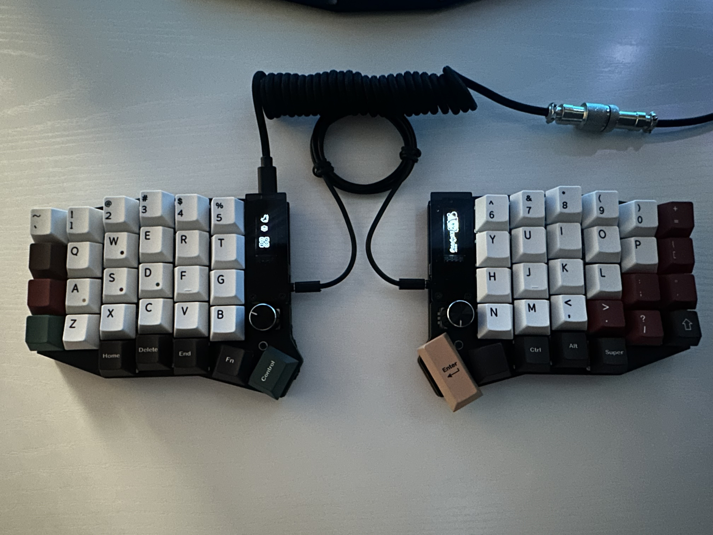

# Configuraciones Sofle RGB para Vial

Este repositorio contiene archivos `.vil` diseñados para ser utilizados con **Vial**, una variante de QMK, en un teclado dividido **Sofle RGB**.

---

## 📷 Foto del armado - Luego le mejoro la calidad a la imagen XD

---

## ⚙️ Características del hardware

- 🔌 **Microcontrolador:** SparkFun ProMicro RP2040
- 🧠 **Firmware:** QMK con soporte para Vial
- 🔁 **Conexión entre mitades:** TRRS
- 💡 **Soporte RGB:** Compatible con retroiluminación RGB (underglow)
- 📟 **Pantallas OLED:** Personalizadas y sincronizadas con el firmware
- 💾 **Formato de firmware:** Solo acepta archivos `.uf2`, no `.hex` o `.bin`

---

## 🧩 Archivos incluidos

- `Config1.vil`: Primer layout base de prueba
- `Config2.vil - La mejor hasta el momento`: Versión estable y que mejor se me ha acomodado

---

## Repositorio de firmware personalizado

Para compilar el firmware compatible con este teclado y el RP2040, se recomienda usar este fork de QMK, ya que el Pro Micro RP2040 solo se puede flashear mediante uf2, y este repo ya tiene el firmware listo en ese formato, ya si quieres usar .hex pues usa otro controlador mejor.

👉 [PandaKBLab/QMK-firmware-for-keyboards](https://github.com/PandaKBLab/QMK-firmware-for-keyboards)

---

## 🛠️ Recomendaciones

- Usa **QMK Toolbox** o herramientas CLI para flashear los `.uf2`
- Si usas Vial, asegúrate de que el firmware esté compilado con soporte para **Vial JSON** (`VIA_ENABLE = yes`, `VIAL_ENABLE = yes`)
- En sistemas Linux, asegúrate de tener permisos para acceder a dispositivos USB, igual si usas Via te dice como crear tu udev rule 

---

## Notas

Este layout fue diseñado pensando en comodidad, accesibilidad a símbolos para programación y eficiencia al usar un teclado dividido ortolineal ;).
